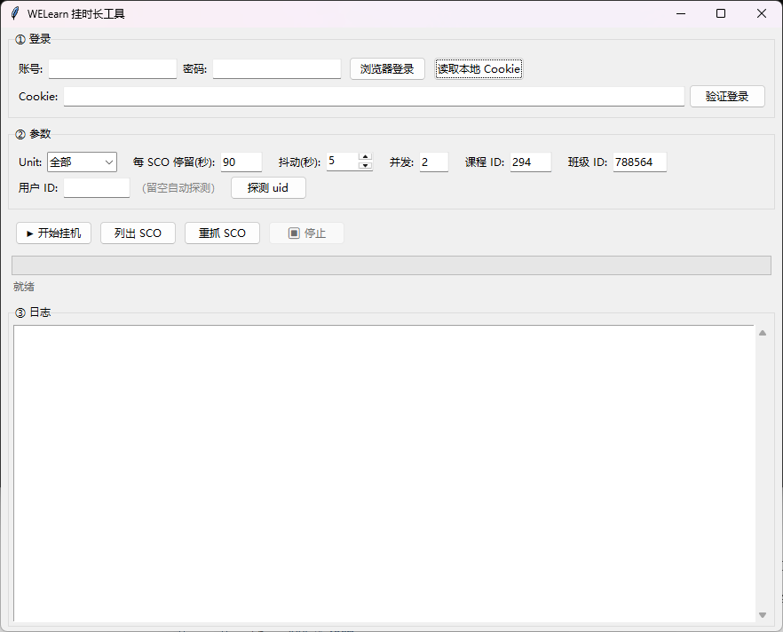
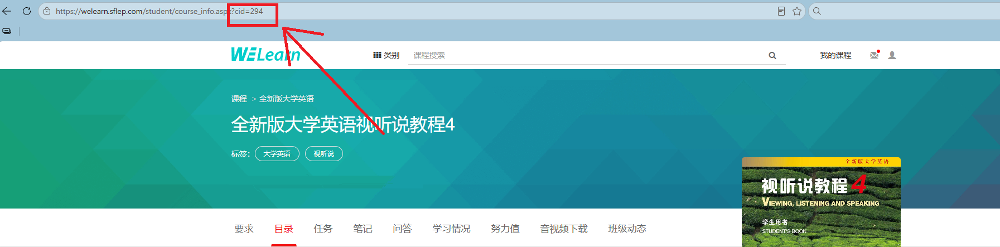
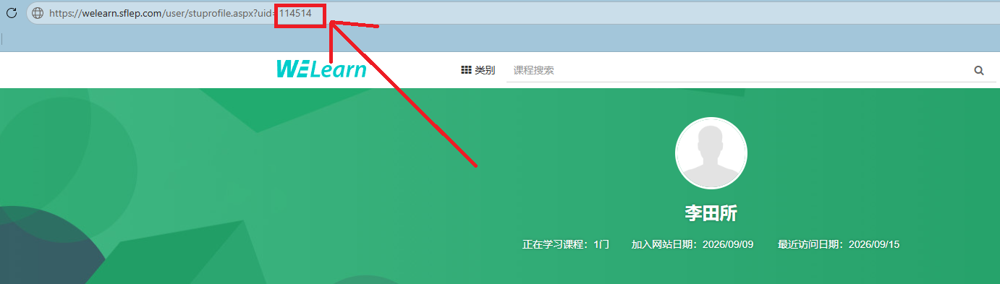

# WELearn GUI — 图形化挂时长工具

一个基于 Python + Tkinter 的 WELearn（随行课堂 / sflep）自动挂时长工具，带图形界面。支持 Playwright 自动登录、Cookie 复用、自动抓取课程 SCO 结构、按单元或全量挂机，并且**只发心跳、不写 interactions / score**，避免分数被清空。

---

## 功能特性

- **三种登录方式**
  - Playwright 弹出真实浏览器自动登录（可手动处理滑块）
  - 读取本地 `cookies.json` / `welearn_cookie.txt`
  - 手动粘贴 Cookie 字符串
- **自动探测** `uid` / `classid` / `username`
- **自动抓取课程 SCO 结构**（从 `StudyCourse.aspx` / `course_info.aspx` 解析 Unit 与叶子 SCO，并缓存到 `scos_cache.json`）
- **按单元挂机**：可选择 `Unit 1` ~ `Unit 8` 或 `全部`
- **只发心跳**：调用 `keepsco_with_getticket_with_updatecmitime` 更新 `total_time`，不写 `setscoinfo`，避免污染答题记录与得分
- **并发控制**：可设置并发线程数、每 SCO 停留时间、随机抖动（降低风控风险）
- **实时日志 + 一键停止**
- **风控检测**：自动检查 `isPausing`（账号锁定）和 `checkNoCaptcha`（是否需要滑块）

---

## 依赖安装

```bash
pip install requests

# 仅"浏览器自动登录"功能需要
pip install playwright
playwright install chromium
```

> 若使用 Edge 通道登录，需要系统已安装 Microsoft Edge；否则可把源码里 `channel="msedge"` 改成 `channel="chrome"` 或直接删掉该参数使用 Playwright 自带的 Chromium。

---

## 快速开始

```bash
python main.py
```

Release版支持Windows，因为依赖edge。


界面分为三个区域：

### ① 登录

| 按钮 | 说明 |
|------|------|
| **浏览器登录** | 弹出 Chromium/Edge，自动填账号密码并提交，若出现滑块请手动完成；成功后自动保存 `cookies.json` 并回填 Cookie 输入框 |
| **读取本地 Cookie** | 从 `cookies.json` 或 `welearn_cookie.txt` 读取 |
| **验证登录** | 验证 Cookie 是否有效，随后自动探测 uid/classid 并抓取 SCO 结构 |

### ② 参数

| 字段 | 说明 |
|------|------|
| **Unit** | 选择要挂的单元（登录后自动更新为实际抓到的单元列表），或选"全部" |
| **每 SCO 停留(秒)** | 每个 SCO 挂机时长，默认 90 秒 |
| **抖动(秒)** | 每个 SCO 额外随机 0~N 秒，降低规律性，默认 5 |
| **并发** | 并发线程数，默认 2 |
| **课程 ID (cid)** | 见下方「如何获取 cid」 |
| **班级 ID (classid)** | 一般自动探测，可留默认 |
| **用户 ID (uid)** | 一般自动探测，也可手动填写，见下方「如何获取 uid」 |

### ③ 日志

实时输出每个 SCO 的执行结果，包含成功/失败、服务器累计秒数、总耗时等。

---

## 如何获取 cid

1. 打开浏览器，登录 WELearn，进入你要挂的课程页面。
2. 查看地址栏，URL 形如：

   ```
   https://welearn.sflep.com/course/courseinfo.aspx?cid=810
   ```

   

3. `cid=` 后面的数字就是**课程 ID**，填入「课程 ID」输入框即可。

> 本工具默认 `cid=294`（全新版大学英语视听说教程 4），请按自己的课程替换。

---

## 如何获取 uid

1. 在 WELearn 页面点击**任意用户头像**，进入其个人主页。
2. 查看地址栏，URL 形如：

   ```
   https://welearn.sflep.com/User/StuProfile.aspx?uid=114514
   ```

   

3. `uid=` 后面的数字就是**用户 ID**。

> ⚠️ **重要提醒：请务必只填写你自己的 uid。**
>
> 虽然从技术上来说，把别人的 uid 填进去也可能跑通接口，但：
> - 这属于**冒用他人身份**的行为，可能给他人账号带来异常记录、封禁等风险；
> - 一旦被平台风控识别，你自己和对方都可能被牵连；
> - **请不要这么做。** 本工具仅用于给自己的账号挂时长。
>
> 正常情况下，点击「验证登录」后脚本会自动探测出你自己的 uid，无需手动获取。

---

## 文件说明

| 文件 | 用途 |
|------|------|
| `main.py` | 主程序 |
| `cookies.json` | Playwright 登录后保存的 Cookie（自动生成） |
| `welearn_cookie.txt` | 手动放一整行 Cookie 字符串（可选） |
| `scos_cache.json` | 抓取到的课程 SCO 结构缓存（自动生成，按 cid 分组） |

---

## 工作原理简述

1. **登录**：拿到有效的 Cookie。
2. **探测**：从课程页 HTML 里正则提取 `uid` / `classid` / `username`。
3. **抓 SCO**：请求 `StudyCourse.aspx` / `course_info.aspx`，按 `Unit N` 切块，提取每个 `<li id="liSCO_ITEM-xxx">` 的叶子节点（跳过 `list_brunch` 容器）。
4. **挂机流程（每个 SCO）**：
   - `isPausing` → 检查是否被锁
   - `checkNoCaptcha` → 检查是否需要滑块
   - `scoAddr` → 获取 SCO 地址
   - `getscoinfo_v7` → 读取历史 `total_time`
   - `startsco160928` → 开始
   - 循环发送 `keepsco_with_getticket_with_updatecmitime`（只更新时长）
   - `savescoinfo160928` → 结束
5. **不做的事**：不调用 `setscoinfo`，不写 `interactions`，不动 `score`。

---

## 常见问题

**Q：验证登录失败？**
A：Cookie 可能已过期，重新用「浏览器登录」获取，或手动更新 `cookies.json`。

**Q：抓不到 SCO？**
A：可能是课程结构特殊（没有 Unit 标记），脚本会尝试把所有 SCO 归到 unit 0；也可以先点「重抓 SCO」并在日志中查看调试信息。

**Q：提示"需要滑块验证"？**
A：说明平台风控触发，请降低并发、增大抖动、休息一段时间再跑。

**Q：提示"账号被锁定 N 分钟"？**
A：账号被临时风控，等待锁定时间结束再试。

**Q：挂完之后分数被清了？**
A：本工具不写 `setscoinfo` / `interactions`，理论上不会影响分数。若出现异常，请检查是否使用了其他会写分数的脚本。

---

## 免责声明

本工具仅供学习与个人账号的自动化实践使用。请勿用于：
- 冒用他人账号（包括填写他人的 uid）；
- 代刷、售卖挂机服务等商业用途；
- 任何违反学校或平台规定的行为。

使用本工具所产生的一切后果由使用者自行承担。
